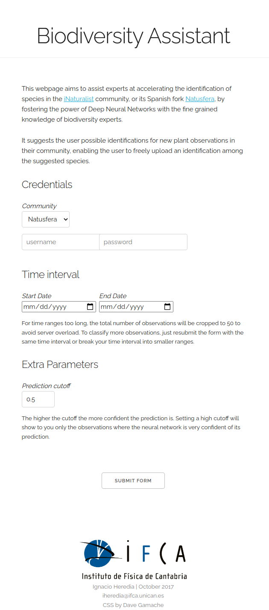

# Plant Classification Assistant
> **Disclaimer**
> The repo is quite old and doesn't work as is. It has been uploaded mainly for archiving purposes.

**Author** Ignacio Heredia
**Date** October 2017

This is a website  that helps experts classify faster new *plant* observations from [iNaturalist](https://www.inaturalist.org/), or its Spanish fork [Natusfera](http://natusfera.gbif.es/). It suggest them likely species (using the [plant classification Deep Learning model](https://github.com/IgnacioHeredia/plant_classification)) and automatically uploads the classification on their behalf.

### Launching the webpage

To launch the web execute the following:
```bash
export FLASK_APP=web.py
python -m flask run
```
and it will start running at http://127.0.0.1:5000. To run the webpage in production mode you can pip-install the `gunicorn` module as an easy drop-in replacement. Once installed just run

```bash
cd ./webpage/webpage_files
gunicorn web:app -b 0.0.0.0:80 --workers 4 --timeout 80 -k gevent
```
***

This has been tested in Ubuntu 14.04 with Python 2.7.12 with the Anaconda 4.2.0 (64-bit) distribution.


